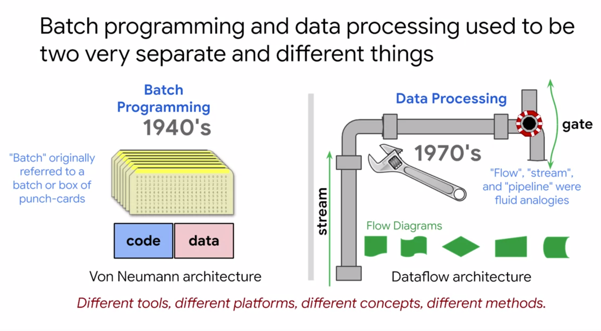
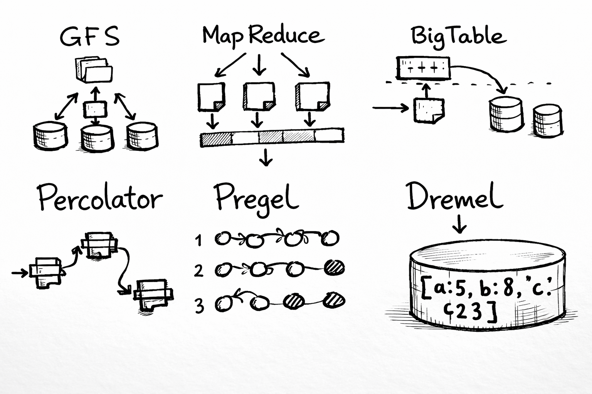
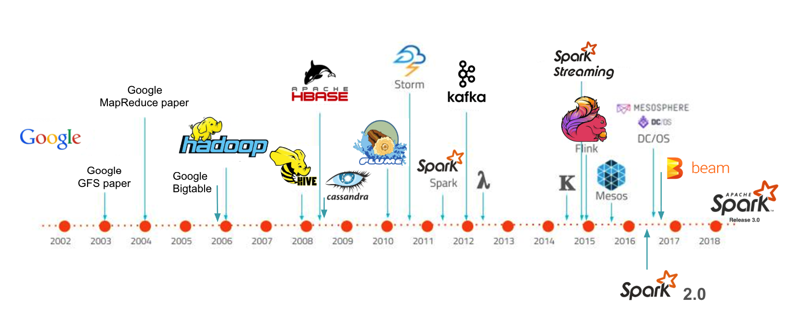

Since the term Big Data was coined, different roles have appeared as needs and the tech ecosystem grew. Data engineering is one of the pillars in designing and building data flows that make data available at the right time and in the right format for the users or systems that need it as input. For example: business, marketing, BI, data scientists, analysts, leadership, and other automated systems like ML/Deep Learning models, APIs, reports, dashboards, etc. Imagination is the limit.

Weeks before writing this article, I was invited by the Apache Spark México community to the meetup “First steps in data engineering with Apache Spark” (you can watch it on YouTube), where we talked about the history before Big Data and the birth of Hadoop and Spark. I decided to expand these core concepts for anyone who wants to start or explore the data engineer role. For simplicity, I’ll use the term “Big Data Engineer.”
Let’s begin the journey!

The need to process data

_Fig 1_

The need for automated data processing goes back to the first generation of computers like ENIAC in the 1940s. When data storage was still in its early days, information was stored on punch cards in binary and processed in batches (“batch processing”) to obtain automated information. This gave rise to batch programming.

Big Data origins
Big Data is more a concept than a technology, and it’s relative to the observer and the time period, so it’s hard to assign a single birth year. Personally, and in agreement with several authors, it started at Google in its early years of growth, when the company faced major technical and economic challenges, such as:

Where and how to store the indexed web?
How to process the large volume of indexed data?
Internally, they developed revolutionary technologies that were later shared publicly when Google published three papers that triggered the Big Data ecosystem and many technologies we use today.

_Fig 2. Big Data papers MapReduce, Google File System and Bigtable: the mother of all big data algorithms_

2003 Google File System (GFS) was the first paper, “the origin of everything.” GFS is a distributed file system where files are split into “chunks” and stored redundantly across a cluster of commodity machines.

Become a member
2004 MapReduce became the reference for distributed processing in Big Data, previously used by Google to compute search indexes.

2006 BigTable inspired NoSQL databases such as Cassandra, HBase, DynamoDB, and others. Cassandra (originally from Facebook) strongly references BigTable in its paper, and Amazon DynamoDB also mentions the influence of GFS and BigTable.

_Fig 3. Big Data — timeline_

We’ve briefly reviewed the history and predecessors of modern Big Data technologies.

Google has played a key role in technological development and innovation. Over the years, as shown in Fig 3, technologies like Hadoop, Spark, Kafka, and Kubernetes have marked a before and after.

In the next posts, we’ll keep exploring this ecosystem and how to take our first steps in data engineering.

See you in the next story!
